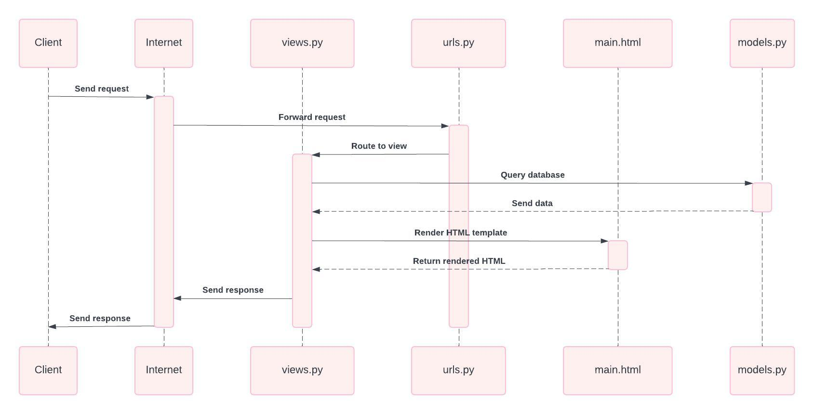

# Toup-up

# Tugas 2

### A. Jelaskan bagaimana cara kamu mengimplementasikan checklist di atas secara step-by-step (bukan hanya sekadar mengikuti tutorial).

1. Aktifkan virtual environment dan install dependencies yang dibutuhkan
2. Membuat proyek Django baru dengan menggunakan perintah `django-admin startproject toup_up .`
3. Membuat aplikasi main dengan perintah `python manage.py startapp main`
4. Membuat model Product di `models.py` dengan atribut name, price, description, quantity, dan available.
```python
    from django.db import models

    class Product(models.Model):
        name = models.CharField(max_length=100)
        price = models.IntegerField()
        description = models.TextField()
        quantity = models.IntegerField()
        available = models.BooleanField()
```
5. Menyiapkan `main.html` yang menampilkan nama aplikasi serta nama dan kelas saya di dalam direktori templates
6. Membuat fungsi `show_main` di `views.py` yang akan dikembalikan ke `main.html` untuk menampilkan nama aplikasi serta nama dan kelas saya

```python
    from django.shortcuts import render

    def show_main(request):
    context = {
        "application": "Toup Up",
        "name": "Dicky Bayu Sadewo",
        "class": "PBP E"
    }

    return render(request, "main.html", context)
```
7. Membuat sebuah routing pada `urls.py` aplikasi main untuk memetakan fungsi yang telah dibuat pada `views.py`
```python
    from django.urls import path
    from main.views import show_main

    app_name = 'main'

    urlpatterns = [
        path('', show_main, name='show_main'),
    ]    
```
8. Melakukan routing pada proyek agar dapat menjalankan aplikasi main
```python
    from django.contrib import admin
    from django.urls import path, include

    urlpatterns = [
        path('admin/', admin.site.urls),
        path('', include('main.urls')),
    ]
```
9. Terakhir, melakukan deployment ke PWS terhadap aplikasi yang sudah dibuat sehingga nantinya dapat diakses melalui internet

### B. Buatlah bagan yang berisi request client ke web aplikasi berbasis Django beserta responnya dan jelaskan pada bagan tersebut kaitan antara urls.py, views.py, models.py, dan berkas html.



Penjelasan:
1. Client mengakses aplikasi website melalui internet dengan mengirimkan request ke URL utama.
2. Request dari internet diterima oleh `urls.py` yang di routing ke `views.py` untuk merender HTML template dan merequest model data ke `models.py`.
3. Fungsi `show_main` di `views.py` sudah mempunyai pre-defined model data sehingga hanya merender HTML template (main.html).
4. `main.html` yang sudah di-render di `views.py` akan dikirimkan ke internet dan diteruskan ke client sebagai response.


### C. Jelaskan fungsi git dalam pengembangan perangkat lunak!
Fungsi-fungsi git dalam pengembangan perangkat lunak:
- Melacak Perubahan Kode: Git memungkinkan pengembang melacak setiap perubahan yang dibuat pada kode, dari perubahan kecil hingga besar. 
- Kolaborasi: Git memungkinkan banyak pengembang bekerja secara bersamaan pada proyek yang sama.
- Pengelolaan Versi dan Riwayat Perubahan: Git menyimpan riwayat dari setiap versi proyek yang pernah dibuat.
- Branching: Git memungkinkan pembuatan branch, yaitu cabang kode yang terpisah dari cabang utama sehingga pengembang dapat mengembangkan fitur baru, memperbaiki bug, atau melakukan eksperimen tanpa menggangu proyek utama.

### D. Menurut Anda, dari semua framework yang ada, mengapa framework Django dijadikan permulaan pembelajaran pengembangan perangkat lunak?
Menurut saya, Django dijadikan permulaan pembelajaran pengembangan perangkat lunak karena:
- Kemudahan Penggunaan dan Dokumentasi yang Lengkap: Dokumentasi Django sangat lengkap dan mudah dipahami, sehingga memudahkan pemula seperti saya untuk mempelajari konsep pengembangan web sambil memahami fitur-fitur dasar framework.
- Skalabilitas dan Fleksibilitas: Django cukup kuat dan scalable untuk proyek besar.
- Security: Django memiliki fitur keamanan bawaan yang membantu melindungi aplikasi dari ancaman cyber.
- Arsitektur Model-View-Template (MVT) : Django menggunakan arsitektur MVT (Model-View-Template), hal ini membantu pemula memahami cara kerja aplikasi web dengan pemisahan logika bisnis, tampilan, dan data. 
- Pengelolaan Database yang Mudah: Django memiliki Object-Relational-Mapping (ORM) bawaan, yang memungkinkan pengembang berinteraksi dengan database hanya dengan menggunakan kode python tanpa perlu menulis SQL secara langsung.

### E. Mengapa model pada Django disebut sebagai ORM?
Model pada Django disebut sebagai ORM (Object-Relational-Mapping) karena fungsinya sebagai penghubung antara model objek dalam kode Python dengan tabel dalam database relasional. Hal ini memungkinkan pengembang untuk berinteraksi dengan database relasional menggunakan kode Python, tanpa perlu menulis query SQL secara langsung.


# Tugas 3

### A. Jelaskan mengapa kita memerlukan data delivery dalam pengimplementasian sebuah platform?

Data delivery sangat penting dalam pengimplementasian sebuah platform karena ada kalanya kita perlu mengirimkan data dari satu stack ke stack lainnya dengan akses data yang cepat, efisien, dan andal. Pengiriman data yang baik mendukung performa platform, menjaga integritas dan keamanan informasi, serta memungkinkan skalabilitas saat jumlah pengguna atau data meningkat. Selain itu, data delivery mendukung interoperabilitas antar-sistem, memastikan pengguna menerima data secara tepat waktu dan aman, yang pada akhirnya meningkatkan pengalaman pengguna.

### B. Menurutmu, mana yang lebih baik antara XML dan JSON? Mengapa JSON lebih populer dibandingkan XML?

Menurut saya, JSON lebih baik dan lebih populer daripada XML karena hal-hal berikut:

- Sintaks Lebih Ringkas dan Mudah Dibaca: JSON memiliki sintaks yang lebih sederhana dan lebih ringkas daripada XML. JSON membuat data lebih mudah dibaca dan dikirim dalam format yang lebih efisien.

- Struktur Lebih Fleksibel: JSON mendukung struktur data seperti objek dan array secara langsung, yang lebih cocok dengan model data pada bahasa pemgrograman modern. Di sisi lain, XML tidak fleksibel dengan penggunaan tag yang berbasis hierarki.

- Kinerja Lebih Baik: Proses parsing JSON lebih cepat dibandingkan dengan XML, yang memerlukan lebih banyak sumber daya karena sintaks yang lebih berat.

Meskipun XML memiliki keunggulan dalam beberapa kasus, seperti mendukung skema yang lebih kompleks untuk validasi data dan kemampuan untuk mengatur metadata, JSON lebih populer karena lebih ringkas dan mudah dalam penggunaannya.

### C. Jelaskan fungsi dari method is_valid() pada form Django dan mengapa kita membutuhkan method tersebut?

Method `is_valid()` pada form Django digunakan untuk memvalidasi data yang dikirimkan ke form Django. Fungsi dari method `is_valid()` adalah mengecek apakah data yang diinputkan ke dalam form sesuai dengan aturan validasi yang telah ditentukan. Metode ini akan mengembalikan *True* jika semua data valid atau *False* jika ada kesalahan. Dengan method ini, kita dapat mencegah data yang tidak valid atau berbahaya masuk ke dalam sistem untuk melindungi aplikasi dari potensi bug atau serangan siber.

### D. Mengapa kita membutuhkan csrf_token saat membuat form di Django? Apa yang dapat terjadi jika kita tidak menambahkan csrf_token pada form Django? Bagaimana hal tersebut dapat dimanfaatkan oleh penyerang?

CSRF (Cross-Site Request Forgery) adalah jenis serangan di mana penyerang dapat membuat permintaan tidak sah atas nama pengguna yang telah terautentikasi di situs web yang sama. Dengan `csrf_token`, kita dapat memvalidasi sesi pengguna yang sah dan memastikan bahwa permintaan form yang dibuat oleh pengguna datang dari sumber yang benar.

Jika `csrf_token` tidak ditambahkan pada form Django, permintaan form yang dikirimkan tanpa token atau dengan token yang tidak valid akan ditolak oleh server. Hal tersebut mengakibatkan form tidak dapat diproses, dan aplikasi menjadi rentan terhadap serangan Cross-Site Request Forgery (CSRF). Penyerang dapat memanfaatkan kelemahan ini dengan membuat permintaan berbahaya dari situs web berbahaya yang tampak sah, menggunakan kredensial pengguna yang sah untuk melakukan tindakan tanpa sepengetahuan atau persetujuan pengguna. Penyerang dapat mengubah pengaturan akun, mentransfer uang, atau melakukan tindakan lain yang merugikan dengan memanfaatkan kelemahan tersebut.

### E. Jelaskan bagaimana cara kamu mengimplementasikan checklist di atas secara step-by-step (bukan hanya sekadar mengikuti tutorial).

1. Membuat `base.html` sebagai kerangka umum untuk halaman web lainnya di dalam proyek.
```python
    
    <!DOCTYPE html>
    <html lang="en">
        <head>
            <meta charset="UTF-8" />
            <meta name="viewport" content="width=device-width, initial-scale=1.0" />
             
        </head>

        <body>
             
        </body>
    </html>
```
2. Menambahkan `BASE_DIR` pada `settings.py` agar berkas `base.html` terdeteksi sebagai berkas template.
```python
    ...
    'DIRS': [BASE_DIR / 'templates'],
    ...
```
3. Menambahkan attribut `id` pada berkas `models.py`
```python
    import uuid
    from django.db import models

    class Product(models.Model):
        id = models.UUIDField(primary_key=True, default=uuid.uuid4, editable=False)
        name = models.CharField(max_length=100)
        price = models.IntegerField()
        description = models.TextField()
        quantity = models.IntegerField()
        available = models.BooleanField()
```
4. Melakukan migrasi model dengan perintah 
```python
    python manage.py makemigrations
    python manage.py migrate
```
5. Membuat `forms.py` untuk membuat struktur form yang dapat menerima data Product baru.
```python
    from django.forms import ModelForm
    from main.models import Product

    class ProductForm(ModelForm):
        class Meta:
            model = Product
            fields = ["name", "price", "description", "quantity", "available"] 
```
6. Menambahkan beberapa import dan juga membuat fungsi baru dengan nama create_product di `views.py` untuk menghasilkan form yang dapat menambahkan data Product secara otomatis ketika data di-submit dari form.
```python
    from django.shortcuts import render, redirect
    from main.forms import ProductForm
    from main.models import Product

    def create_product(request):
        form = ProductForm(request.POST or None)

        if form.is_valid() and request.method == "POST":
            form.save()
            return redirect("main:show_main")

        context = {'form': form}    
        return render(request, "create_product.html", context)
```
7. Mengubah fungsi `show_main` yang sudah ada pada berkas `views.py`
```python
    def show_main(request):
        products = Product.objects.all()
        context = {
            "application": "Toup Up",
            "name": "Dicky Bayu Sadewo",
            "class": "PBP E",
            "products": products
        }

        return render(request, "main.html", context)
```
8. Membuat fungsi `show_xml`,`show_json`,`show_xml_by_id`,`show_json_by_id` untuk melihat objek yang sudah ditambahkan dari input user.
```python
def show_xml(request):
    data = Product.objects.all()
    return HttpResponse(serializers.serialize("xml", data), content_type="application/xml")

def show_json(request):
    data = Product.objects.all()
    return HttpResponse(serializers.serialize("json", data), content_type="application/json")

def show_xml_by_id(request, id):
    data = Product.objects.filter(pk=id)
    return HttpResponse(serializers.serialize("xml", data), content_type="application/xml")

def show_json_by_id(request, id):
    data = Product.objects.filter(pk=id)
    return HttpResponse(serializers.serialize("json", data), content_type="application/json")
```
9. Melakukan routing URL untuk masing-masing views di `urls.py` pada `main`
```python
    from django.urls import path
    from main.views import show_main, create_product, show_xml, show_json, show_xml_by_id, show_json_by_id

    app_name = 'main'

    urlpatterns = [
        path('', show_main, name='show_main'),
        path('create-product', create_product, name='create_product'),
        path('xml/', show_xml, name='show_xml'),
        path('json/', show_json, name='show_json'),
        path('xml/<str:id>/', show_xml_by_id, name='show_xml_by_id'),
        path('json/<str:id>/', show_json_by_id, name='show_json_by_id'),
    ]
```
10. Membuat berkas baru dengan nama `create_product.html` pada direktori `templates` untuk tampilan form meminta input dari pengguna.
 

```python
    <h1>Add New Product</h1>

    <form method="POST">
    
    <table>
        {{ form.as_table }}
        <tr>
        <td></td>
        <td>
            <input type="submit" value="Add Product" />
        </td>
        </tr>
    </table>
    </form>

    
```
11. Menambahkan beberapa kode di dalam `` pada `main.html` untuk menampilkan data product dari hasil input pengguna.
```python
    
    
    <h1>Toup Up</h1>

    <h5>Application: </h5>
    <p>{{ application }}</p>

    <h5>Name: </h5>
    <p>{{ name }}</p>

    <h5>Class: </h5>
    <p>{{ class }}</p>

    
    <p>Belum ada data product pada toup up.</p>
    
    <table>
    <tr>
        <th>Product Name</th>
        <th>Price</th>
        <th>Description</th>
        <th>Quantity</th>
        <th>Available</th>
    </tr>

    
    <tr>
        <td>{{product.name}}</td>
        <td>{{product.price}}</td>
        <td>{{product.description}}</td>
        <td>{{product.quantity}}</td>
        <td>{{product.available}}</td>
    </tr>
    
    </table>
    

    <br />

    <a href="">
    <button>Add New product</button>
    </a>
    
```
## Screenshot Postman
### XML


### JSON


### XML by ID


### JSON by ID


