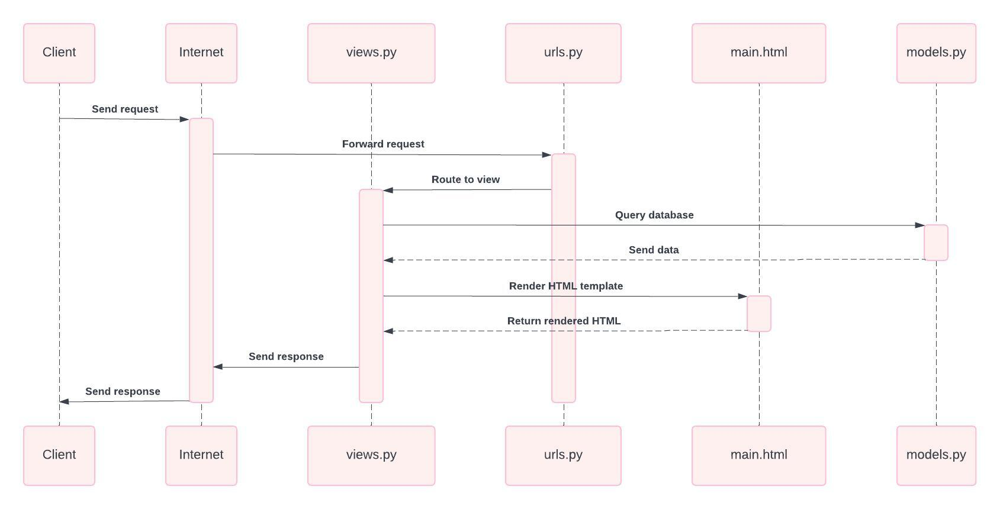
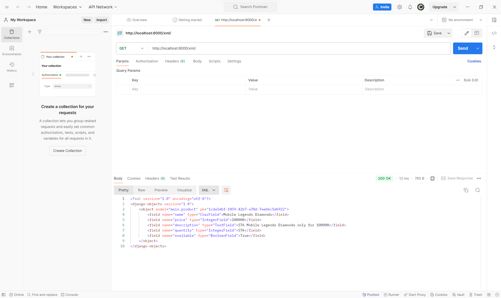
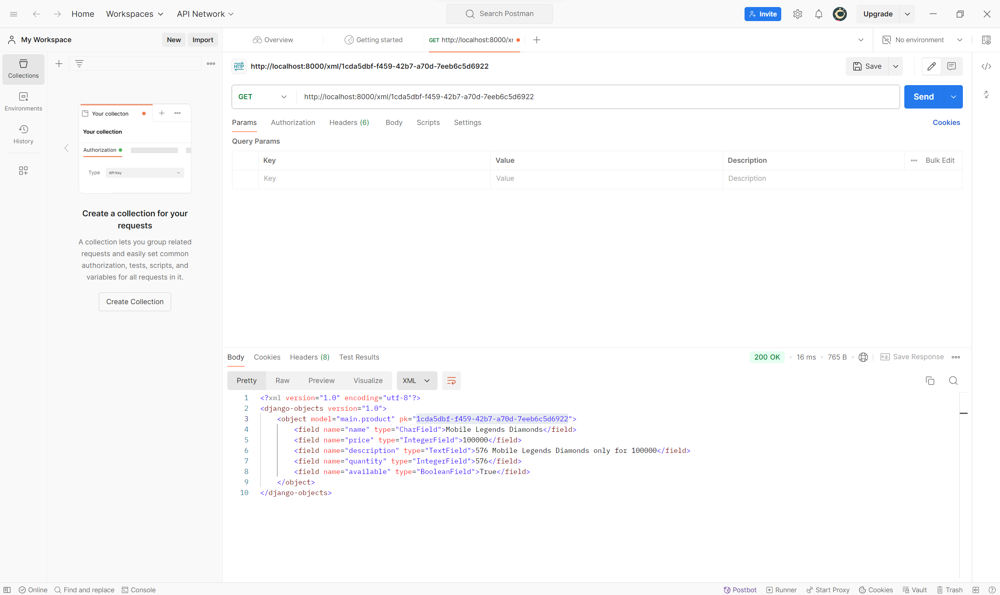
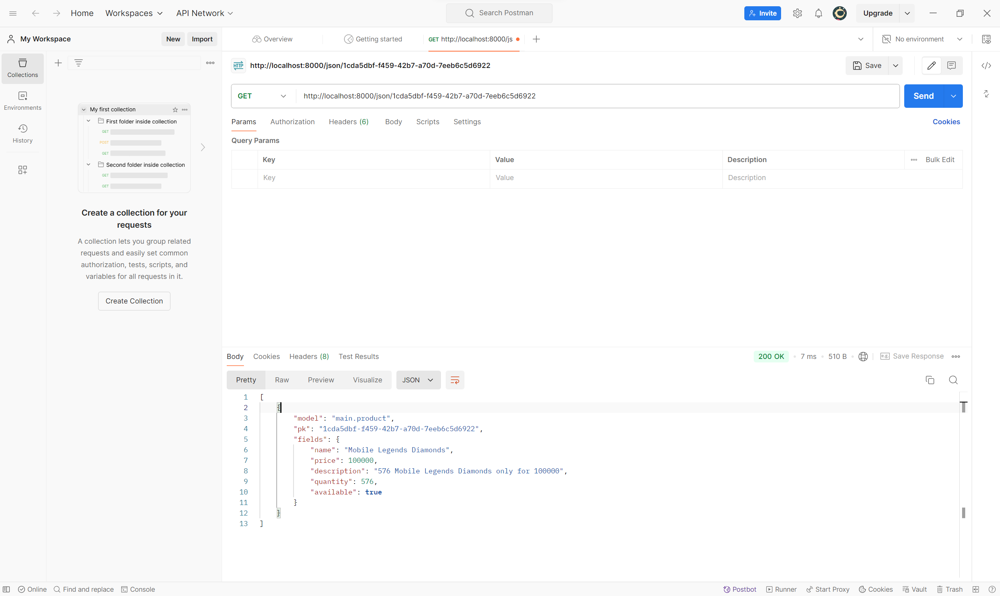

# Toup-up

Nama : Dicky Bayu Sadewo

NPM : 2306275784

Kelas : PBP E

## Deployment Link
https://dicky-bayu31-toupup.pbp.cs.ui.ac.id/

# Tugas 2

### A. Jelaskan bagaimana cara kamu mengimplementasikan checklist di atas secara step-by-step (bukan hanya sekadar mengikuti tutorial).

1. Aktifkan virtual environment dan install dependencies yang dibutuhkan
2. Membuat proyek Django baru dengan menggunakan perintah `django-admin startproject toup_up .`
3. Membuat aplikasi main dengan perintah `python manage.py startapp main`
4. Membuat model Product di `models.py` dengan atribut name, price, description, quantity, dan available.
```python
    from django.db import models

    class Product(models.Model):
        name = models.CharField(max_length=100)
        price = models.IntegerField()
        description = models.TextField()
        quantity = models.IntegerField()
        available = models.BooleanField()
```
5. Menyiapkan `main.html` yang menampilkan nama aplikasi serta nama dan kelas saya di dalam direktori templates
6. Membuat fungsi `show_main` di `views.py` yang akan dikembalikan ke `main.html` untuk menampilkan nama aplikasi serta nama dan kelas saya

```python
    from django.shortcuts import render

    def show_main(request):
    context = {
        "application": "Toup Up",
        "name": "Dicky Bayu Sadewo",
        "class": "PBP E"
    }

    return render(request, "main.html", context)
```
7. Membuat sebuah routing pada `urls.py` aplikasi main untuk memetakan fungsi yang telah dibuat pada `views.py`
```python
    from django.urls import path
    from main.views import show_main

    app_name = 'main'

    urlpatterns = [
        path('', show_main, name='show_main'),
    ]    
```
8. Melakukan routing pada proyek agar dapat menjalankan aplikasi main
```python
    from django.contrib import admin
    from django.urls import path, include

    urlpatterns = [
        path('admin/', admin.site.urls),
        path('', include('main.urls')),
    ]
```
9. Terakhir, melakukan deployment ke PWS terhadap aplikasi yang sudah dibuat sehingga nantinya dapat diakses melalui internet

### B. Buatlah bagan yang berisi request client ke web aplikasi berbasis Django beserta responnya dan jelaskan pada bagan tersebut kaitan antara urls.py, views.py, models.py, dan berkas html.



Penjelasan:
1. Client mengakses aplikasi website melalui internet dengan mengirimkan request ke URL utama.
2. Request dari internet diterima oleh `urls.py` yang di routing ke `views.py` untuk merender HTML template dan merequest model data ke `models.py`.
3. Fungsi `show_main` di `views.py` sudah mempunyai pre-defined model data sehingga hanya merender HTML template (main.html).
4. `main.html` yang sudah di-render di `views.py` akan dikirimkan ke internet dan diteruskan ke client sebagai response.


### C. Jelaskan fungsi git dalam pengembangan perangkat lunak!
Fungsi-fungsi git dalam pengembangan perangkat lunak:
- Melacak Perubahan Kode: Git memungkinkan pengembang melacak setiap perubahan yang dibuat pada kode, dari perubahan kecil hingga besar. 
- Kolaborasi: Git memungkinkan banyak pengembang bekerja secara bersamaan pada proyek yang sama.
- Pengelolaan Versi dan Riwayat Perubahan: Git menyimpan riwayat dari setiap versi proyek yang pernah dibuat.
- Branching: Git memungkinkan pembuatan branch, yaitu cabang kode yang terpisah dari cabang utama sehingga pengembang dapat mengembangkan fitur baru, memperbaiki bug, atau melakukan eksperimen tanpa menggangu proyek utama.

### D. Menurut Anda, dari semua framework yang ada, mengapa framework Django dijadikan permulaan pembelajaran pengembangan perangkat lunak?
Menurut saya, Django dijadikan permulaan pembelajaran pengembangan perangkat lunak karena:
- Kemudahan Penggunaan dan Dokumentasi yang Lengkap: Dokumentasi Django sangat lengkap dan mudah dipahami, sehingga memudahkan pemula seperti saya untuk mempelajari konsep pengembangan web sambil memahami fitur-fitur dasar framework.
- Skalabilitas dan Fleksibilitas: Django cukup kuat dan scalable untuk proyek besar.
- Security: Django memiliki fitur keamanan bawaan yang membantu melindungi aplikasi dari ancaman cyber.
- Arsitektur Model-View-Template (MVT) : Django menggunakan arsitektur MVT (Model-View-Template), hal ini membantu pemula memahami cara kerja aplikasi web dengan pemisahan logika bisnis, tampilan, dan data. 
- Pengelolaan Database yang Mudah: Django memiliki Object-Relational-Mapping (ORM) bawaan, yang memungkinkan pengembang berinteraksi dengan database hanya dengan menggunakan kode python tanpa perlu menulis SQL secara langsung.

### E. Mengapa model pada Django disebut sebagai ORM?
Model pada Django disebut sebagai ORM (Object-Relational-Mapping) karena fungsinya sebagai penghubung antara model objek dalam kode Python dengan tabel dalam database relasional. Hal ini memungkinkan pengembang untuk berinteraksi dengan database relasional menggunakan kode Python, tanpa perlu menulis query SQL secara langsung.


# Tugas 3

### A. Jelaskan mengapa kita memerlukan data delivery dalam pengimplementasian sebuah platform?

Data delivery sangat penting dalam pengimplementasian sebuah platform karena ada kalanya kita perlu mengirimkan data dari satu stack ke stack lainnya dengan akses data yang cepat, efisien, dan andal. Pengiriman data yang baik mendukung performa platform, menjaga integritas dan keamanan informasi, serta memungkinkan skalabilitas saat jumlah pengguna atau data meningkat. Selain itu, data delivery mendukung interoperabilitas antar-sistem, memastikan pengguna menerima data secara tepat waktu dan aman, yang pada akhirnya meningkatkan pengalaman pengguna.

### B. Menurutmu, mana yang lebih baik antara XML dan JSON? Mengapa JSON lebih populer dibandingkan XML?

Menurut saya, JSON lebih baik dan lebih populer daripada XML karena hal-hal berikut:

- Sintaks Lebih Ringkas dan Mudah Dibaca: JSON memiliki sintaks yang lebih sederhana dan lebih ringkas daripada XML. JSON membuat data lebih mudah dibaca dan dikirim dalam format yang lebih efisien.

- Struktur Lebih Fleksibel: JSON mendukung struktur data seperti objek dan array secara langsung, yang lebih cocok dengan model data pada bahasa pemgrograman modern. Di sisi lain, XML tidak fleksibel dengan penggunaan tag yang berbasis hierarki.

- Kinerja Lebih Baik: Proses parsing JSON lebih cepat dibandingkan dengan XML, yang memerlukan lebih banyak sumber daya karena sintaks yang lebih berat.

Meskipun XML memiliki keunggulan dalam beberapa kasus, seperti mendukung skema yang lebih kompleks untuk validasi data dan kemampuan untuk mengatur metadata, JSON lebih populer karena lebih ringkas dan mudah dalam penggunaannya.

### C. Jelaskan fungsi dari method is_valid() pada form Django dan mengapa kita membutuhkan method tersebut?

Method `is_valid()` pada form Django digunakan untuk memvalidasi data yang dikirimkan ke form Django. Fungsi dari method `is_valid()` adalah mengecek apakah data yang diinputkan ke dalam form sesuai dengan aturan validasi yang telah ditentukan. Metode ini akan mengembalikan *True* jika semua data valid atau *False* jika ada kesalahan. Dengan method ini, kita dapat mencegah data yang tidak valid atau berbahaya masuk ke dalam sistem untuk melindungi aplikasi dari potensi bug atau serangan siber.

### D. Mengapa kita membutuhkan csrf_token saat membuat form di Django? Apa yang dapat terjadi jika kita tidak menambahkan csrf_token pada form Django? Bagaimana hal tersebut dapat dimanfaatkan oleh penyerang?

CSRF (Cross-Site Request Forgery) adalah jenis serangan di mana penyerang dapat membuat permintaan tidak sah atas nama pengguna yang telah terautentikasi di situs web yang sama. Dengan `csrf_token`, kita dapat memvalidasi sesi pengguna yang sah dan memastikan bahwa permintaan form yang dibuat oleh pengguna datang dari sumber yang benar.

Jika `csrf_token` tidak ditambahkan pada form Django, permintaan form yang dikirimkan tanpa token atau dengan token yang tidak valid akan ditolak oleh server. Hal tersebut mengakibatkan form tidak dapat diproses, dan aplikasi menjadi rentan terhadap serangan Cross-Site Request Forgery (CSRF). Penyerang dapat memanfaatkan kelemahan ini dengan membuat permintaan berbahaya dari situs web berbahaya yang tampak sah, menggunakan kredensial pengguna yang sah untuk melakukan tindakan tanpa sepengetahuan atau persetujuan pengguna. Penyerang dapat mengubah pengaturan akun, mentransfer uang, atau melakukan tindakan lain yang merugikan dengan memanfaatkan kelemahan tersebut.

### E. Jelaskan bagaimana cara kamu mengimplementasikan checklist di atas secara step-by-step (bukan hanya sekadar mengikuti tutorial).

1. Membuat `base.html` sebagai kerangka umum untuk halaman web lainnya di dalam proyek.
```python
    
    <!DOCTYPE html>
    <html lang="en">
        <head>
            <meta charset="UTF-8" />
            <meta name="viewport" content="width=device-width, initial-scale=1.0" />
             
        </head>

        <body>
             
        </body>
    </html>
```
2. Menambahkan `BASE_DIR` pada `settings.py` agar berkas `base.html` terdeteksi sebagai berkas template.
```python
    ...
    'DIRS': [BASE_DIR / 'templates'],
    ...
```
3. Menambahkan attribut `id` pada berkas `models.py`
```python
    import uuid
    from django.db import models

    class Product(models.Model):
        id = models.UUIDField(primary_key=True, default=uuid.uuid4, editable=False)
        name = models.CharField(max_length=100)
        price = models.IntegerField()
        description = models.TextField()
        quantity = models.IntegerField()
        available = models.BooleanField()
```
4. Melakukan migrasi model dengan perintah 
```python
    python manage.py makemigrations
    python manage.py migrate
```
5. Membuat `forms.py` untuk membuat struktur form yang dapat menerima data Product baru.
```python
    from django.forms import ModelForm
    from main.models import Product

    class ProductForm(ModelForm):
        class Meta:
            model = Product
            fields = ["name", "price", "description", "quantity", "available"] 
```
6. Menambahkan beberapa import dan juga membuat fungsi baru dengan nama create_product di `views.py` untuk menghasilkan form yang dapat menambahkan data Product secara otomatis ketika data di-submit dari form.
```python
    from django.shortcuts import render, redirect
    from main.forms import ProductForm
    from main.models import Product

    def create_product(request):
        form = ProductForm(request.POST or None)

        if form.is_valid() and request.method == "POST":
            form.save()
            return redirect("main:show_main")

        context = {'form': form}    
        return render(request, "create_product.html", context)
```
7. Mengubah fungsi `show_main` yang sudah ada pada berkas `views.py`
```python
    def show_main(request):
        products = Product.objects.all()
        context = {
            "application": "Toup Up",
            "name": "Dicky Bayu Sadewo",
            "class": "PBP E",
            "products": products
        }

        return render(request, "main.html", context)
```
8. Membuat fungsi `show_xml`,`show_json`,`show_xml_by_id`,`show_json_by_id` untuk melihat objek yang sudah ditambahkan dari input user.
```python
def show_xml(request):
    data = Product.objects.all()
    return HttpResponse(serializers.serialize("xml", data), content_type="application/xml")

def show_json(request):
    data = Product.objects.all()
    return HttpResponse(serializers.serialize("json", data), content_type="application/json")

def show_xml_by_id(request, id):
    data = Product.objects.filter(pk=id)
    return HttpResponse(serializers.serialize("xml", data), content_type="application/xml")

def show_json_by_id(request, id):
    data = Product.objects.filter(pk=id)
    return HttpResponse(serializers.serialize("json", data), content_type="application/json")
```
9. Melakukan routing URL untuk masing-masing views di `urls.py` pada `main`
```python
    from django.urls import path
    from main.views import show_main, create_product, show_xml, show_json, show_xml_by_id, show_json_by_id

    app_name = 'main'

    urlpatterns = [
        path('', show_main, name='show_main'),
        path('create-product', create_product, name='create_product'),
        path('xml/', show_xml, name='show_xml'),
        path('json/', show_json, name='show_json'),
        path('xml/<str:id>/', show_xml_by_id, name='show_xml_by_id'),
        path('json/<str:id>/', show_json_by_id, name='show_json_by_id'),
    ]
```
10. Membuat berkas baru dengan nama `create_product.html` pada direktori `templates` untuk tampilan form meminta input dari pengguna.
 

```python
    <h1>Add New Product</h1>

    <form method="POST">
    
    <table>
        {{ form.as_table }}
        <tr>
        <td></td>
        <td>
            <input type="submit" value="Add Product" />
        </td>
        </tr>
    </table>
    </form>

    
```
11. Menambahkan beberapa kode di dalam `` pada `main.html` untuk menampilkan data product dari hasil input pengguna.
```python
    
    
    <h1>Toup Up</h1>

    <h5>Application: </h5>
    <p>{{ application }}</p>

    <h5>Name: </h5>
    <p>{{ name }}</p>

    <h5>Class: </h5>
    <p>{{ class }}</p>

    
    <p>Belum ada data product pada toup up.</p>
    
    <table>
    <tr>
        <th>Product Name</th>
        <th>Price</th>
        <th>Description</th>
        <th>Quantity</th>
        <th>Available</th>
    </tr>

    
    <tr>
        <td>{{product.name}}</td>
        <td>{{product.price}}</td>
        <td>{{product.description}}</td>
        <td>{{product.quantity}}</td>
        <td>{{product.available}}</td>
    </tr>
    
    </table>
    

    <br />

    <a href="">
    <button>Add New product</button>
    </a>
    
```
## Screenshot Postman
### XML


### JSON


### XML by ID


### JSON by ID


# Tugas 4

### A. Apa perbedaan antara `HttpResponseRedirect()` dan `redirect()`

- Fleksibilitas:
    - `redirect()` lebih fleksibel dalam penggunaannya karena dapat menerima nama view, URL string, atau bahkan objek model yang memiliki metode `get_absolute_url()`
    - `HttpResponseRedirect()` hanya menerima URL string dan tidak memiliki fleksibilitas seperti `redirect()`

- Kemudahan:
    - `redirect() lebih mudah digunakan dalam banyak kasus karena kita tidak perlu mengatur URL secara manual`


### B. Jelaskan cara kerja penghubungan model `Product` dengan `User`!

Penghubungan antara model `Product` dengan `user` biasanya dihubungkan menggunakan `models.ForeignKey`. Dengan hadirnya     `ForeignKey`, setiap `Product` dapat terhubung ke pengguna tertentu yang telah login.

Cara kerja penghubungan menggunakan `ForeignKey` adalah dengan setiap kali `user` membuat `Product`, `Product` akan dihubungkan dengan `user` yang login. `ForeignKey` dalam Django bekerja dengan cara menghubungkan satu model ke model lainnya melalui relasi one-to-many. Dengan `ForeignKey`, kita dapat dengan mudah mengelola hubungan antar tabel di database, mengambil data terkait, dan mengatur apa yang terjadi ketika data dihapus.

### C. Apa perbedaan antara authentication dan authorization, apakah yang dilakukan saat pengguna login? Jelaskan bagaimana Django mengimplementasikan kedua konsep tersebut.

Authentication adalah proses memverifikasi identitas seorang pengguna. Proses ini bertujuan untuk memastikan bahwa pengguna yang mencoba mengakses aplikasi adalah pengguna yang valid.

Authorization adlaah proses menentukan apakah pengguna yang telah terautentikasi memiliki izin untuk melakukan tindakan tertentu atau mengakses sumber daya tertentu.

Ketika seorang pengguna login, sistem langsung akan menjalankan proses autentikasi untuk memverifikasi identitas pengguna tesebut. Setelah pengguna berhasil diautentikasi, sistem akan menjalankan proses berikutnya yaitu otorisasi untuk memastikan dan memutuskan hak akses apa saja yang dapat dimiliki oleh seorang pengguna tersebut.

Authentication di Django ditangani melalui sistem otentikasi bawaan `django.contrib.auth`. Sedangkan Authorization, Django menyediakan decorator seperti `login_required` dan sistem izin untuk membantu mengelola otorisasi.

### D. Bagaimana Django mengingat pengguna yang telah login? Jelaskan kegunaan lain dari cookies dan apakah semua cookies aman digunakan?

Django mengingat pengguna yang telah login dengan menggunakan session dan cookies. Ketika pengguna login, Django akan membuat sebuah session yang menyimpan informasi pengguna, lalu Django akan memberikan session ID yang disimpan di browser pengguna sebagai cookie. Setiap kali pengguna berinteraksi dengan server, cookie yang mengandung session ID dikirimkan kembali ke server. Django menggunakan session ID tersebut untuk mengambil data sesi dari server dan memastikan bahwa pengguna tersebut masih dalam status login.

Kegunaan lain dari cookies:
- Menyimpan Preferensi Pengguna: Cookies dapat menyimpan preferensi pengguna seperti pengaturan bahasa dan tampilan yang dipilih.
- Melacak Aktivitas Pengguna: Cookies dapat digunakan untuk melacak aktivitas pengguna seperti halaman yang dikunjungi atau produk yang dilihat
- Menyimpan token keamanan: Cookies dapat digunakan untuk menyimpan token keamanan, seperti token CSRF (Cross-Site Request Forgery) yang melindungi dari serangan siber.

Tidak semua cookies aman untuk digunakan, karena cookies bisa digunakan dalam serangan seperti XSS dan CSRF. Oleh karena itu, Django menyediakan pengaturan seperti HttpOnly dan Secure Cookies untuk mengurangi risiko tersebut.

### E. Jelaskan bagaimana cara kamu mengimplementasikan checklist di atas secara step-by-step (bukan hanya sekadar mengikuti tutorial).


1. Membuat fungsi `register` di berkas `views.py`
```python
    def register(request):
        form = UserCreationForm()

        if request.method == "POST":
            form = UserCreationForm(request.POST)
            if form.is_valid():
                form.save()
                messages.success(request, 'Your account has been successfully created!')
                return redirect('main:login')
        context = {'form':form}
        return render(request, 'register.html', context)
```
2. Membuat berkas bernama `register.html` pada direktori `main/templates`
```python
    

    
    <title>Register</title>
    

    

    <div class="login">
    <h1>Register</h1>

    <form method="POST">
        
        <table>
        {{ form.as_table }}
        <tr>
            <td></td>
            <td><input type="submit" name="submit" value="Daftar" /></td>
        </tr>
        </table>
    </form>

    
    <ul>
        
        <li>{{ message }}</li>
        
    </ul>
    
    </div>

    
```
3. Mmebuat fungsi `login_user` di berkas `views.py`
```python
    def login_user(request):
    if request.method == 'POST':
        form = AuthenticationForm(data=request.POST)

        if form.is_valid():
                user = form.get_user()
                login(request, user)
                response = HttpResponseRedirect(reverse("main:show_main"))
                response.set_cookie('last_login', str(datetime.datetime.now()))
                return response

    else:
        form = AuthenticationForm(request)
    context = {'form': form}
    return render(request, 'login.html', context)
```
4. Membuat berkas bernama `login.html` pada direktori `main/templates`
```python
    

    
    <title>Login</title>
    

    
    <div class="login">
    <h1>Login</h1>

    <form method="POST" action="">
        
        <table>
        {{ form.as_table }}
        <tr>
            <td></td>
            <td><input class="btn login_btn" type="submit" value="Login" /></td>
        </tr>
        </table>
    </form>

    
    <ul>
        
        <li>{{ message }}</li>
        
    </ul>
     Don't have an account yet?
    <a href="">Register Now</a>
    </div>

    
```
5. Membuat fungsi `logout` di berkas `views.py`
```python
    def logout_user(request):
        logout(request)
        response = HttpResponseRedirect(reverse('main:login'))
        response.delete_cookie('last_login')
        return response
```
6. Menambahkan button `logout` pada berkas `main.html`
```python
    <a href="">
    <button>Logout</button>
    </a>
```
7. Menambahkan path url ke dalam `urlpatterns` pada berkas `urls.py` untuk register, login, dan juga logout
```python
    path('register/', register, name='register'),
    path('login/', login_user, name='login'),
    path('logout/', logout_user, name='logout'),
```
8. Pada model `Product` di `models.py` tambahkan ForeignKey untuk menghubungkan model `Product` dengan `User`
```python
    class Product(models.Model):
        user = models.ForeignKey(User, on_delete=models.CASCADE)
        id = models.UUIDField(primary_key=True, default=uuid.uuid4, editable=False)
        name = models.CharField(max_length=100)
        price = models.IntegerField()
        description = models.TextField()
        quantity = models.IntegerField()
        available = models.BooleanField()
```

# Tugas 5

### Jika terdapat beberapa CSS selector untuk suatu elemen HTML, jelaskan urutan prioritas pengambilan CSS selector tersebut!

Dalam CSS, jika terdapat beberapa selektor yang berlaku pada suatu elemen HTML, urutan prioritas selektor tersebut diatur berdasarkan aturan yang sudah ditentukan dengan aturan berikut:

1. Important Rule, aturan `!important` akan menjadi prioritas tertinggi dibandingkan aturan lainnya.
2. Inline Styles, aturan inline styles akan selalu didahulukan dibandingkan aturan CSS eksternal atau internal yang lain.
3. ID Selector, aturan ID selector memiliki prioritas yang lebih tinggi daripada Class,atribut, atau tag HTML biasa.
4. Class Selector, aturan Class selector memiliki prioritas lebih rendah dibandingkan ID, tetapi lebih tinggi dari tag HTML.
5. Tag Selector, aturan Tag selector menjadi prioritas lebih renda daripada aturan lainnya di atas.
6. Universal Selector, Combinators, Inheritance, aturan ini memiliki prioritas paling rendah.

### B. Mengapa responsive design menjadi konsep yang penting dalam pengembangan aplikasi web? Berikan contoh aplikasi yang sudah dan belum menerapkan responsive design!

Responsive design menjadi konsep yang penting dalam pengembangan aplikasi web karena pengguna pengguna saat ini mengakses website dari berbagai perangkat dengan ukuran layar yang berbeda, seperti desktop, tablet, dan smartphone. Responsive design dapat memastikan tampilan dan fungsionalitas website tetap optimal di semua perangkat, meningkatkan pengalaman pengguna dan aksesibilitas. Dari sisi pengembangan, responsive design juga dapat menghemat waktu dan biaya, karena hanya perlu mengembangkan satu situs yang bisa berfungsi di berbagai perangkat. 

Contoh aplikasi yang sudah menerapkan responsive design:
- X (Twitter)
- Traveloka
- Tokopedia

Contoh aplikasi yang belum menerapkan responsive design:
- PWS
- Beberapa aplikasi lama seperti aplikasi pemerintah atau UMKM yang belum mengadopsi responsive design.

### C. Jelaskan perbedaan antara margin, border, dan padding, serta cara untuk mengimplementasikan ketiga hal tersebut!

- Margin, margin merupakan sebuah ruang kosong di luar elemen. Margin memisahkan jarak antara elemen tersebut dengan elemen lain di sekitarnya. Margin tidak memiliki warna dan bersifat transparan.
implementasi:
```python
    div {
        margin-top: 10px;
        margin-right: 30px;
        margin-bottom: 20px;
        margin-left: 25px;
    }
```
- Border, border merupakan garis yang mengelilingi elemen di antara padding dan margin. Border dapat memiliki warna, ketebalan, dan styling yang bisa kita atur sendiri.
implementasi:
```python
    div {
        border-top: 2px dashed gray;
        border-right: 6px solid blue;
        border-bottom: 2px dotted green;
        border-left: 3px double yellow;
    }
```
- Padding, padding merupakan ruang di dalam elemen, antara konten elemen dan border elemen tersebut. Padding bertujuan untuk menjaga jarak antara konten dan border.
implementasi:
```python
    div {
        padding-top: 16px;
        padding-right: 20px;
        padding-bottom: 15px;
        padding-left: 18px;
    }
```

### D. Jelaskan konsep flexbox dan grid layout beserta kegunaannya!

- Flexbox:
    Flexbox merupakan model layout yang dirancang untuk menyusun elemen dalam satu dimensi, secara horizontal maupun vertikal. Flexbox sangat cocok untuk mengelola layout yang dinamis dan fleksibel, di mana elemen bisa disusun untuk mengisi ruang kosong di container.

    Kegunaan:
    - Mengatur elemen-elemen secara vertikal dan horizontal dengan mudah.
    - Mengatur jarak elemen dan mendistribusikan ruang kosong di antara elemen.
    - Mengatur elemen agar responsif, seperti membuat elemen menyesuaikan ukuran layar secara otomatis.

- Grid:
    Grid merupakan sistem layout dua dimensi yang lebih kompleks dibandingkan flexbox, memungkinkan kita untuk mengatur elemen dalam baris dan kolom secara bersamaan. Dengan grid, kita dapat mengatur bagaimana elemen disusun dalam bentuk tabel atau kotak yang lebih terstuktur.

    Kegunaan:
    - Mengatur elemen-elemen secara vertikal dan horizontal (dua dimensi).
    - Mengatur layout yang lebih kompleks, seperti dashboard, galeri, atau tampilan produk e-commerce.
    - Mengatur tata letak secara detail, seperti mengatur ukuran kolom, baris, dan bagaimana elemen-elemen ditempatkan dalam grid.


### E. Jelaskan bagaimana cara kamu mengimplementasikan checklist di atas secara step-by-step (bukan hanya sekadar mengikuti tutorial)!

1. Menambahkan Tailwind di `base.html`
```python
    <head>
    
        <meta charset="UTF-8" />
        <meta name="viewport" content="width=device-width, initial-scale=1">
    
    <script src="https://cdn.tailwindcss.com">
    </script>
    </head>
```
2. Menambahkan fungsi `edit_product` dan `delete_product` pada `views.py`
```python
    def edit_product(request, id):
        product = Product.objects.get(pk=id)
        form = ProductForm(request.POST or None, instance=product)

        if form.is_valid() and request.method == "POST":
            form.save()
            return HttpResponseRedirect(reverse('main:show_main'))

        context = {'form': form}
        return render(request, "edit_product.html", context)

    def delete_product(request, id):
        product = Product.objects.get(pk=id)
        product.delete()
        return HttpResponseRedirect(reverse('main:show_main'))
```
3. Melakukan routing dari kedua fungsi tersebut pada `urls.py`
```python
    path('edit-product/<uuid:id>', edit_product, name='edit_product'),
    path('delete/<uuid:id>', delete_product, name='delete_product')
```
4. Membuat `global.css` untuk mengatur tampilan web secara general di `/static/css`
```python
    .form-style form input, form textarea, form select {
        width: 100%;
        padding: 0.5rem;
        border: 2px solid #bcbcbc;
        border-radius: 0.375rem;
    }
    .form-style form input:focus, form textarea:focus, form select:focus {
        outline: none;
        border-color: #674ea7;
        box-shadow: 0 0 0 3px #674ea7;
    }
    @keyframes shine {
        0% { background-position: -200% 0; }
        100% { background-position: 200% 0; }
    }
    .animate-shine {
        background: linear-gradient(120deg, rgba(255, 255, 255, 0.3), rgba(255, 255, 255, 0.1) 50%, rgba(255, 255, 255, 0.3));
        background-size: 200% 100%;
        animation: shine 3s infinite;
    }
```
5. Membuat `navbar.html` pada folder `templates/` di root directory
```python
    <nav class="bg-gray-900 shadow-lg fixed top-0 left-0 z-40 w-screen">
        <div class="max-w-[95rem] mx-auto px-4 sm:px-6 lg:px-8">
        <div class="flex items-center justify-between h-16">
            <div class="flex items-center">
            <h1 class="text-2xl font-bold text-center text-blue-500">Toup Up</h1>
            </div>
            
            <div class="hidden md:flex items-center space-x-16">
            
                <a href="#" class="text-gray-300 hover:text-white transition duration-300">Home</a>
                <a href="#" class="text-gray-300 hover:text-white transition duration-300">Products</a>
                <a href="#" class="text-gray-300 hover:text-white transition duration-300">Categories</a>
                <a href="#" class="text-gray-300 hover:text-white transition duration-300">Cart</a>
                <span class="text-gray-300 mr-4">Welcome, {{ user.username }}</span>

                <a href="" class="text-center bg-red-500 hover:bg-red-600 text-white font-bold py-2 px-4 rounded transition duration-300">
                Logout
                </a>
            
                <a href="" class="text-center bg-blue-500 hover:bg-blue-600 text-white font-bold py-2 px-4 rounded transition duration-300 mr-2">
                Login
                </a>
                <a href="" class="text-center bg-green-500 hover:bg-green-600 text-white font-bold py-2 px-4 rounded transition duration-300">
                Register
                </a>
            
            </div>
    
            <div class="md:hidden flex items-center">
            <button class="mobile-menu-button">
                <svg class="w-6 h-6 text-white" fill="none" stroke-linecap="round" stroke-linejoin="round" stroke-width="2" viewBox="0 0 24 24" stroke="currentColor">
                <path d="M4 6h16M4 12h16M4 18h16"></path>
                </svg>
            </button>
            </div>
        </div>
        </div>
    
        <div class="mobile-menu hidden md:hidden bg-gray-800 px-4 w-full md:max-w-full">
        <div class="pt-2 pb-3 space-y-4 mx-auto flex flex-col">
            
            <a href="#" class="text-gray-300 hover:text-white transition duration-300">Home</a>
            <a href="#" class="text-gray-300 hover:text-white transition duration-300">Products</a>
            <a href="#" class="text-gray-300 hover:text-white transition duration-300">Categories</a>
            <a href="#" class="text-gray-300 hover:text-white transition duration-300">Cart</a>        
            <span class="block text-gray-300">Welcome, {{ user.username }}</span>
            <a href="" class="block text-center bg-red-500 hover:bg-red-600 text-white font-bold py-2 px-4 rounded transition duration-300">
                Logout
            </a>
            
            <a href="" class="block text-center bg-blue-500 hover:bg-blue-600 text-white font-bold py-2 px-4 rounded transition duration-300 mb-2">
                Login
            </a>
            <a href="" class="block text-center bg-green-500 hover:bg-green-600 text-white font-bold py-2 px-4 rounded transition duration-300">
                Register
            </a>
            
        </div>
        </div>
    </nav>
    <script>
        const btn = document.querySelector("button.mobile-menu-button");
        const menu = document.querySelector(".mobile-menu");
    
        btn.addEventListener("click", () => {
        menu.classList.toggle("hidden");
        });
    </script>
  
```
6. Menambahkan path untuk static folder pada `settings.py`
```python
    STATIC_URL = '/static/'
    if DEBUG:
        STATICFILES_DIRS = [
            BASE_DIR / 'static' 
        ]
    else:
        STATIC_ROOT = BASE_DIR / 'static' 
```
7. Membuat tampilan `login.html` pada subdirektori `main/templates/` seperti berikut:
```python
    

    
    <title>Login</title>
    

    
    <div class="min-h-screen flex items-center justify-center w-screen bg-gray-800 py-12 px-4 sm:px-6 lg:px-8">
    <div class="max-w-md w-full space-y-8 bg-gray-900 p-8 rounded-lg shadow-lg">
        <div>
        <h2 class="mt-6 text-center text-blue-500 text-3xl font-extrabold">
            Login to your account
        </h2>
        </div>
        <form class="mt-8 space-y-6" method="POST" action="">
        
        <input type="hidden" name="remember" value="true">
        <div class="rounded-md shadow-sm -space-y-px">
            <div>
            <label for="username" class="sr-only">Username</label>
            <input id="username" name="username" type="text" required class="appearance-none rounded-none relative block w-full px-3 py-2 bg-gray-700 border border-gray-600 placeholder-gray-400 text-white rounded-t-md focus:outline-none focus:ring-blue-500 focus:border-blue-500 focus:z-10 sm:text-sm" placeholder="Username">
            </div>
            <div>
            <label for="password" class="sr-only">Password</label>
            <input id="password" name="password" type="password" required class="appearance-none rounded-none relative block w-full px-3 py-2 bg-gray-700 border border-gray-600 placeholder-gray-400 text-white rounded-b-md focus:outline-none focus:ring-blue-500 focus:border-blue-500 focus:z-10 sm:text-sm" placeholder="Password">
            </div>
        </div>

        <div>
            <button type="submit" class="group relative w-full flex justify-center py-2 px-4 border border-transparent text-sm font-medium rounded-md text-white bg-green-500 hover:bg-green-600 focus:outline-none focus:ring-2 focus:ring-offset-2 focus:ring-green-500">
            Sign in
            </button>
        </div>
        </form>

        
        <div class="mt-4">
        
        
            <div class="bg-green-100 border border-green-400 text-green-700 px-4 py-3 rounded relative" role="alert">
            <span class="block sm:inline">{{ message }}</span>
            </div>
        
            <div class="bg-red-100 border border-red-400 text-red-700 px-4 py-3 rounded relative" role="alert">
            <span class="block sm:inline">{{ message }}</span>
            </div>
        
            <div class="bg-blue-100 border border-blue-400 text-blue-700 px-4 py-3 rounded relative" role="alert">
            <span class="block sm:inline">{{ message }}</span>
            </div>
        
        
        </div>
        

        <div class="text-center mt-4">
        <p class="text-sm text-gray-300">
            Don't have an account yet?
            <a href="" class="font-medium text-blue-500 hover:text-blue-600">
            Register Now
            </a>
        </p>
        </div>
    </div>
    </div>
    

```
8. Membuat tampilan `register.html` 
```python
    

    
    <title>Register</title>
    

    
    <div class="min-h-screen flex items-center justify-center bg-gray-800 py-12 px-4 sm:px-6 lg:px-8">
    <div class="max-w-md w-full space-y-8 bg-gray-900 p-8 rounded-lg shadow-lg form-style">
        <div>
        <h2 class="mt-6 text-center text-3xl font-extrabold text-blue-500">
            Create your account
        </h2>
        </div>
        <form class="mt-8 space-y-6" method="POST">
        
        <input type="hidden" name="remember" value="true">
        <div class="rounded-md shadow-sm -space-y-px">
            
            <div class="mt-4">
                <label for="{{ field.id_for_label }}" class="mb-2 font-semibold text-white">
                {{ field.label }}
                </label>
                <div class="relative">
                {{ field }}
                <div class="absolute inset-y-0 right-0 pr-3 flex items-center pointer-events-none">
                    
                    <svg class="h-5 w-5 text-red-500" fill="currentColor" viewBox="0 0 20 20">
                        <path fill-rule="evenodd" d="M18 10a8 8 0 11-16 0 8 8 0 0116 0zm-7 4a1 1 0 11-2 0 1 1 0 012 0zm-1-9a1 1 0 00-1 1v4a1 1 0 102 0V6a1 1 0 00-1-1z" clip-rule="evenodd" />
                    </svg>
                    
                </div>
                </div>
                
                
                    <p class="mt-1 text-sm text-red-600">{{ error }}</p>
                
                
            </div>
            
        </div>

        <div>
            <button type="submit" class="group relative w-full flex justify-center py-2 px-4 border border-transparent text-sm font-medium rounded-md text-white bg-green-500 hover:bg-green-600 focus:outline-none focus:ring-2 focus:ring-offset-2 focus:ring-green-500 transition">
            Register
            </button>
        </div>
        </form>

        
        <div class="mt-4">
        
        <div class="bg-red-100 border border-red-400 text-red-700 px-4 py-3 rounded relative" role="alert">
            <span class="block sm:inline">{{ message }}</span>
        </div>
        
        </div>
        

        <div class="text-center mt-4">
        <p class="text-sm text-gray-300">
            Already have an account?
            <a href="" class="font-medium text-blue-500 hover:text-blue-600">
            Login here
            </a>
        </p>
        </div>
    </div>
    </div>
    

```
9. Membuat `card_product.html` untuk menampilkan atribut-atribut product, mengedit, dan juga menghapus product. 
```python
    <div class="bg-gray-900 shadow-lg rounded-lg overflow-hidden border border-blue-500 transition-transform duration-300 hover:scale-105 hover:border-blue-400">
    <div class="bg-gray-900 text-white p-4 border-b border-blue-500">
        <h3 class="text-xl font-bold mb-2">{{ product.name }}</h3>
    </div>
    
    <div class="p-4 space-y-4">
        <div class="space-y-1">
        <p class="text-blue-400 font-semibold">Price:</p>
        <p class="text-white">${{ product.price }}</p>
        </div>

        <div class="space-y-1">
        <p class="text-blue-400 font-semibold">Description:</p>
        <p class="text-gray-300">{{ product.description|truncatewords:20 }}</p>
        </div>

        <div class="space-y-1">
        <p class="text-blue-400 font-semibold">Quantity Available:</p>
        <p class="text-white">{{ product.quantity }}</p>
        </div>

        <div class="space-y-1">
        <p class="text-blue-400 font-semibold">Availability:</p>
        
            <span class="text-green-500 font-bold">In Stock</span>
        
            <span class="text-red-500 font-bold">Out of Stock</span>
        
        </div>
    </div>

    <div class="flex justify-between items-center bg-gray-900 p-4 rounded-b-lg border-t border-blue-500">
        <a href="" class="bg-yellow-500 hover:bg-yellow-600 text-white rounded-full p-2 transition duration-300 shadow-md">
        <svg xmlns="http://www.w3.org/2000/svg" class="h-6 w-6" fill="currentColor" viewBox="0 0 20 20">
            <path d="M13.586 3.586a2 2 0 112.828 2.828l-.793.793-2.828-2.828.793-.793zM11.379 5.793L3 14.172V17h2.828l8.38-8.379-2.83-2.828z" />
        </svg>
        </a>
        <a href="" class="bg-red-500 hover:bg-red-600 text-white rounded-full p-2 transition duration-300 shadow-md">
        <svg xmlns="http://www.w3.org/2000/svg" class="h-6 w-6" fill="currentColor" viewBox="0 0 20 20">
            <path fill-rule="evenodd" d="M9 2a1 1 0 00-.894.553L7.382 4H4a1 1 0 000 2v10a2 2 0 002 2h8a2 2 0 002-2V6a1 1 0 100-2h-3.382l-.724-1.447A1 1 0 0011 2H9zM7 8a1 1 0 012 0v6a1 1 0 11-2 0V8zm5-1a1 1 0 00-1 1v6a1 1 0 102 0V8a1 1 0 00-1-1z" clip-rule="evenodd" />
        </svg>
        </a>
    </div>
    </div>
```
10. Memperbaiki tampilan `create_product.html` 
```python
    
    

    
    <title>Create Product</title>
    

    
    

    <div class="flex flex-col min-h-screen bg-gray-800">
    <div class="container mx-auto px-4 py-8 mt-16 max-w-xl">
        <h1 class="text-3xl font-bold text-center mb-8 text-blue-500">Create Product</h1>
        <div class="bg-gray-900 shadow-md rounded-lg p-6 form-style">
        <form method="POST" class="space-y-6">
            
            
            <div class="flex flex-col">
                <label for="{{ field.id_for_label }}" class="mb-2 font-semibold text-blue-400">
                {{ field.label }}
                </label>
                <div class="w-full">
                {{ field }}
                </div>
                
                <p class="mt-1 text-sm text-gray-400">{{ field.help_text }}</p>
                
                
                <p class="mt-1 text-sm text-red-500">{{ error }}</p>
                
            </div>
            
            <div class="flex justify-center mt-6">
            <button type="submit" class="bg-green-500 text-white font-semibold px-6 py-3 rounded-lg hover:bg-green-600 transition duration-300 ease-in-out w-full">
                Create Product
            </button>
            </div>
        </form>
        </div>
    </div>
    </div>

    

```
11. Memperbaiki tampilan `edit_product.html` 
```python
    
    

    
    <title>Edit Product</title>
    

    
    

    <div class="flex flex-col min-h-screen bg-gray-800">
    <div class="container mx-auto px-4 py-8 mt-16 max-w-xl">
        <h1 class="text-3xl font-bold text-center mb-8 text-blue-500">Edit Product</h1>
        <div class="bg-gray-900 rounded-lg shadow-md p-6 form-style">
        <form method="POST" class="space-y-6">
            
            
            <div class="flex flex-col">
                <label for="{{ field.id_for_label }}" class="mb-2 font-semibold text-blue-400">
                {{ field.label }}
                </label>
                <div class="w-full">
                {{ field }}
                </div>
                
                <p class="mt-1 text-sm text-gray-400">{{ field.help_text }}</p>
                
                
                <p class="mt-1 text-sm text-red-500">{{ error }}</p>
                
            </div>
            
            <div class="flex justify-center mt-6">
            <button type="submit" class="bg-green-500 hover:bg-green-600 text-white font-semibold px-6 py-3 rounded-lg transition duration-300 ease-in-out w-full">
                Edit Product
            </button>
            </div>
        </form>
        </div>
    </div>
    </div>

    

```


